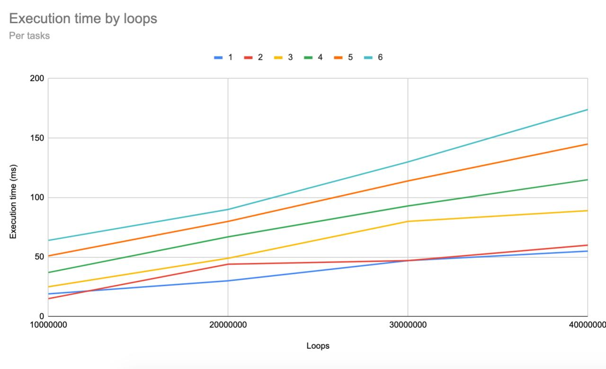

% Rapport ITR 
% Hugo Saint-Vignes ;Marc Zundel
% 2020-04-26
# [TD1] Mesure de temps et échantillonnage en temps

Pour compiler les fichiers, éxecuter la commande suivante à la racine du projet :

`make td1`

Les exécutables de chaque sous-questions seront dans le dossier `./build`.

## a) Gestion simplifiée du temps Posix

Les fonctions sont implémentées dans le fichier `posixHelpers.cpp`.

Elles sont testées dans le main du fichier `posixHelpers.test.cpp`.

Exécuter `build/td1_a.out` pour faire les tests.

## b) Timers avec callback

Une fonction générique de timer est implémentée dans le fichier `posixTimer.cpp`.

Elle peut etre testée dans le main du fichier `posixTimer.test.cpp`.

Exécuter `build/td1_b.out` pour tester la fonction.

## c) Fonction simple consommant du CPU

La fonction de l'incrément et le test sont implementés dans le fichier `IncrC.cpp`.

Pour la tester, il faut l'executer avec la commande suivante : 
```build/td1_c.out 10000000```

## d) Mesure du temps d’exécution d’une fonction

Il faut déclarer pStop comme `volatile bool` pour que le compilateur ne fasse pas de suppositions sur sa valeur.

Dans le fichier `mesureExecution.cpp`, la mesure du temps d'execution est effectuée, des parametres sont calculées et vérifiés.

L'objet Timer de la question b est réutilisé.

Pour le vérifier, une incrémentation est effectuée, et on compare le temps d'execution mesuré par la formule et celui mesuré.

Je trouve en général une erreur relative de l'ordre de 50% dans la calibration.

Pour tester, exécuter `build/td1_d.out`.

## e) Amélioration des mesures

La précision de la mesure pourrait etre améliorée en mesurant plus de fois le nombre de boucles pour un `t` donné, et en effectuant une moyenne.

On pourrait aussi supposer `l(t)` affine par morceaux, et calibrer avec plus de deux points pour se rapprocher au mieux de la courbe réelle `l(t)`.

Enfin, il faudrait s'assurer que la fonction calib ne soit pas perturbée par d'autres taches. On pourrait l'executer dans un thread à priorité maximale. Cependant, nous ne pouvons pas etre complètement sur qu'aucunes taches ne pourra perturber celle-ci.

\pagebreak

# [TD2] Familiarisation avec l’API multitâches pthread

Pour compiler les fichiers, éxecuter la commande suivante à la racine du projet :

`make td2`

Les exécutables de chaque sous-questions seront dans le dossier `./build`.

## a) Exécution sur plusieurs tâches sans mutex

Cette exécution est implémentée dans le fichier `withoutMutex.cpp`.

Il faut ajouter `-pthread` lors de la compilation (géré dans le makefile du projet).

En excutant plusieurs fois `build/td2_a.out nLoops nTasks`, on observe plusieurs valeurs de compteurs, inférieures à `nTasks * nLoops`.

L'opération d'incrémentation n'etant pas atomique, elles peuvent rentrer en conflit et des incrémentations sont perdues.

## b) Mesure de temps d’exécution

Cette exécution est implémentée dans le fichier `withPolicy.cpp`.

On observe que, environ une fois sur deux, le total du compteur est soit égal à `nLoops`, soit égal à `nLoops * nTasks`.

Pour la tester, exécuter `build/td2_b.out nLoops nTasks schedPolicy`.

En tracant les temps d'execution, on obtient le graphique suivant :  
{width=100%}


## c) Exécution sur plusieurs tâches avec mutex

Cette exécution est implémentée dans le fichier `withMutex.cpp`.

Avec les mutex, le programme est bien plus lent (et d'autant plus lent qu'il y a de taches), mais la valeur finale du compteur est fiable.

Pour la tester, exécuter `build/td2_c.out nLoops nTasks schedPolicy protected`.

\pagebreak

# [TD3] Classes pour la gestion du temps

## a) Classe Chrono

Le chronomètre est implémenté dans le fichier `Chrono.cpp` et testé dans le fichier `a.cpp`.
Dans ce second fichier, nous testons les fonctions stop, restart et lap, et vérifions que la différence entre la valeur attendue par timespec_wait etla valeur mesurée par le chronomètre ne dépasse pas 5 millisecondes (pour prendre en compte le délai d'exécution entre les instructions)

## b) Classe Timer

Le constructeur et le destructeur de la classe `Timer`, ainsi que les méthodes `start` et `stop` sont des éléments publics : en effet, pour que n'importe quel élément puisse utiliser la classe `Timer` pour créer, démarrer, arrêter et détruire un `Timer`, il est nécessaire que ces méthodes soient accessibles à tous, donc publiques.

L'attribut de class `timer_t` et la méthode `callback` sont des éléments protégés : il n'est pas sécurisé de les laisser publics, sans quoi n'importe quel élément pourrait modifier le comportement du `Timer` en changeant la fonction de `callback` ou en fournissant un tid erroné. Cependant, afin de pouvoir construire des `Timer` particuliers, et d'implémenter la fonction `callback` (virtuelle pure dans Timer), il est nécessaire que ces deux éléments soient accessibles par les classes dérivées. 

La méthode de class `call_callback` est privée, car elle ne fait qu'appeler la méthode `callback` après la fin du timer, et n'a donc pas de raison d'être modifiée ultérieurement. Son utilité est de permettre d'appeler callback depuis un timer posix : en effet, cette dernière est une méthode protégée, et le timer posix n'a pas le contrôle sur l'objet `Timer` qui l'a créé, et ne peut donc pas appeler directement la fonction `callback`

La méthode callback est virtuelle pure : en effet, elle doit être implémentée de façon spécifique à chaque `Timer`.
La méthode `start`doit également être virtuelle afin de pouvoir être surchargée pour faire le `PeriodicTimer`.

## c) Calibration en temps d'une boucle

Le calibrateur est implémenté dans les fichiers `Calibrator.cpp` et `Looper.cpp`, et testé grâce à `c.cpp`.
La calibration est effectuée sur 1000 mesures, effectuées toutes les millisecondes. 
On constate un décalage de plusieurs centaines de millisecondes entre le temps prévu pour les tests (4 et 6 secondes), et le temps réellement nécessaire pour effectuer le nombre de boucles calculé grâce aux valeurs calibrées.

\pagebreak

# [TD4] Classes de base pour la programmation multitâches

Pour compiler les fichiers, éxecuter la commande suivante à la racine du projet :

`make td4`

Les exécutables de chaque sous-questions seront dans le dossier `./build`.

## a) Classe Thread

Les classes `Thread` et `PosixThread` sont implémentés dans les fichiers `src/td4/Thread.cpp` et `src/td4/PosixThread.cpp`.

Le script `src/td4/a.cpp` Teste ces implementations en 3 tests en utilsant des Thread d'incrementation de compteur (`src/td4/AIncrementer.cpp`) jusqu'à 100 000 000:
- 1 : Test des mesure de temps d'exceution, de la méthode `join` et `sleep`.
- 2 : Test de la méthode `join` avec timeout : La premiere tentative echoue, tandis que la seconde join le thread avant le timeout.
- 3 : test de la concurrence : Dix threads concurents sont lancés, la valeur finale du compteur n'est pas celle attendue.

Ce script peut être exécuté avec la commande `build/td4_a.out`.

## b) Classes Mutex et Mutex::Lock

Les classes `Mutex`, `Mutex::Monitor`, `Mutex::Lock` et `Mutex::TryLock` sont implémentées dans le fichier `src/td4/Mutex.cpp`.

Le compteur avec accès protégé par Mutex est implémenté dans le fichier `src/td4/BIncrementer.cpp`. Son fonctionnement est testé dans le premier test du script `src/td4/b.cpp`, où trois compteurs protégés sont lancés en parallèle.

On observe que le compte est bon, mais que la vitesse d'execution est moindre comparée au test 3 de la partie a.

La classe `Thread` est aussi complétée du champs booléen `started`, testé dans le second test du script, où l'on tente à deux reprise d'exécuter la méthode `start()` sur un thread actif. 

Ce script peut être exécuté avec la commande `build/td4_b.out`.

## c) Classe Semaphore

La classe `Semaphore` est implémentée dans le fichier `src/td4/Semaphore.cpp`.

Dans le script `src/td4/c.cpp`, un sémaphore est partagé par des tâches à la fois consommatrices et productrices, implémentées dans le fichier `src/td4/CProducer.cpp`.

Cette tâche prend un jeton, attend 100 ms, puis donne un jeton au sémaphore.
Avec 10 taches consomatrices, et un sémaphore initialisé à 5 jetons, on vérifie avec le script bien une execution en 200ms.
Les prises et rendus de jetons sont aussi affichés.

Ce script peut être exécuté avec la commande `build/td4_c.out`.

## c) Classe Fifo multitâches

La classe `Fifo` est entierement implémentée dans le fichier `src/td4/Fifo.hpp`.

Pour tester cette classe, le script `src/td4/d.cpp` utilise la classe `Cproducer`, implémentée dans le script `src/td4/Cproducer.cpp`.

Ce producer consomme une tache de la Fifo (un entier `n` strictement positif), attend 10 ms, puis produit deux taches : `n-1` et `n-2`, tant qu'ils sont strictement supérieurs à 0. Ce dernier consomme indéfiniement les éléments de la Fifo, a moins que son timeout ne soit atteint.

Dans notre exemple, la Fifo est initialisé avec les entiers `5`, `4`, `3`, `2` et `1`, et deux `Cproducer` sont crées, puis mis en route pour consommer la Fifo.

Une fois les timeout des deux taches atteints, on vérifie que toutes les tahces (initialeemnt entrée, mais aussi produites) ont bien étée consommées, et que le Fifo est bien vide.

Ce script peut être exécuté avec la commande `build/td4_d.out`.

\pagebreak

# [TD6] Object actif

Pour compiler les fichiers, éxecuter la commande suivante à la racine du projet :

`make td6`

L'executable est dans le dossier `./build`.

Les classes `ActiveObject`, `Request`, `ActiveCalc`, `Calculator` et `CrunchReq` sont implémentés dans le dossier `src/td4/`.

Le script `src/td4/main.cpp` permet de tester ces implémentations avec la classe `Client`.

Celle-ci soumet un calcul avec sa `seed` comme paramètre au calculateur, poursuit d'autres instruction (patiente 1 500 ms), puis attend le résultat.

Chaque calculs prend 500 ms et renvoie le paramètre en sortie.

On s'attends dans un premier temps à ce que chaque client recoive sa propre `seed` à l'issue du calcul.

En lançant 10 clients, on s'attends aussi à ce que les trois premiers qui soumettent leur tâche ne recoivent un résultat qu'au bout de 1 500 ms(du fait des autres instructions). 

Tous les autres clients devront successivement recevoir leur résultat toutes les 500ms, tous devraient alors leurs résultats en environ 5 000 ms ou moins.

Les clients étant successivement crées (on laisse 1 ms entre chaque `client.start()`), et de part la structure de la Fifo, les clients devraient recevoir leur résultats dans le même ordre.

Le script peut être exécuté avec la commande `build/td6.out`, et il vérifie tous les comportements décrits ci-dessus.