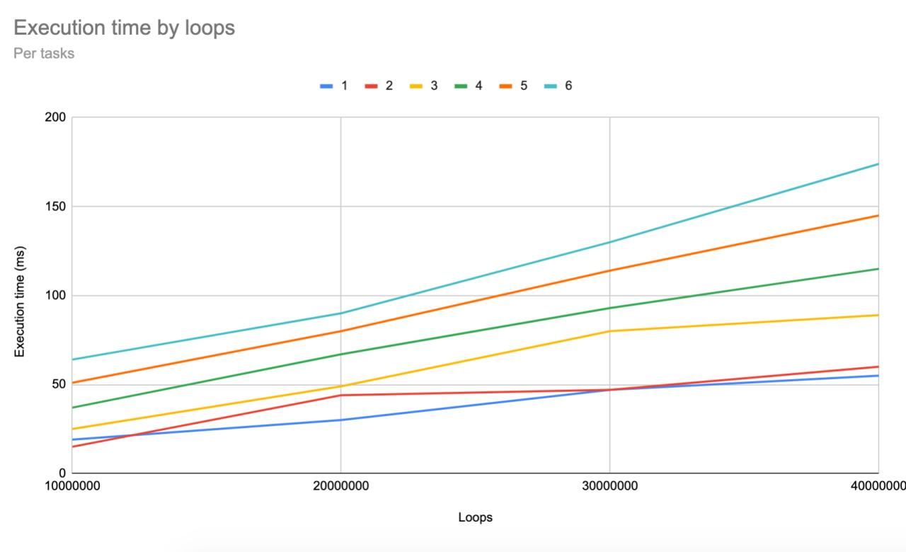

# [TD2] Familiarisation avec l’API multitâches pthread

Pour compiler les fichiers, éxecuter la commande suivante à la racine du projet :

`make td2`

Les exécutables de chaque sous-questions seront dans le dossier `./build`.

## a) Exécution sur plusieurs tâches sans mutex

Cette exécution est implémentée dans le fichier `withoutMutex.cpp`.

Il faut ajouter `-pthread` lors de la compilation (géré dans le makefile du projet).

En excutant plusieurs fois `build/td2_a.out nLoops nTasks`, on observe plusieurs valeurs de compteurs, inférieures à `nTasks * nLoops`.

L'opération d'incrémentation n'etant pas atomique, elles peuvent rentrer en conflit et des incrémentations sont perdues.

## b) Mesure de temps d’exécution

Cette exécution est implémentée dans le fichier `withPolicy.cpp`.

On observe que, environ une fois sur deux, le total du compteur est soit égal à `nLoops`, soit égal à `nLoops * nTasks`.

Pour la tester, exécuter `build/td2_b.out nLoops nTasks schedPolicy`.

En tracant les temps d'execution, on obtient le graphique suivant :

## c) Exécution sur plusieurs tâches avec mutex

Cette exécution est implémentée dans le fichier `withMutex.cpp`.

Avec les mutex, le programme est bien plus lent (et d'autant plus lent qu'il y a de taches), mais la valeur finale du compteur est fiable.

Pour la tester, exécuter `build/td2_c.out nLoops nTasks schedPolicy protected`.